# Triangle Method

\[
\begin{array}{rrrrrrrrrrr}
&&&&& 1 &&&&& \\
&&&& -1 && -1 &&&& \\
&&& 0 && 2 && 0 &&& \\
&& 0 && -1 && -1 && 0 && \\
& -1 && 2 && -1 && 2 && -1 & \\
1 && -1 && 0 && 0 && -1 && 1
\end{array}
\]

\[
\small \sum_{\mathrm{cyc}}\left(x^5-x^4y-x^4z+2x^3yz-x^2y^2z\right)=\frac{x^2+y^2+z^2}{2}\sum_{\mathrm{cyc}}x(x-y)(x-z)+\frac12\sum_{\mathrm{cyc}}x^3(x-y)(x-z)\ge 0.
\]

Triangle Method is a local exact prover for homogeneous polynomial inequalities in
three nonnegative real variables. It treats the coefficients of a degree-
\(n\) polynomial as points in an equilateral triangular arrangement, then tries
to reconstruct the polynomial as a nonnegative rational combination of smaller
known inequalities and squares.

The repository contains two interfaces to the same proof engine:

- a focused React application for entering coefficient triangles of degrees 2
  through 12; and
- a Python package for exact polynomial models, proof search, certificate
  construction and verification, counterexample search, and coefficient-only
  SVG/HTML exports.

A successful result is mathematical evidence rather than a numerical guess. The
backend rebuilds every component and checks the final polynomial identity with
exact rational arithmetic before reporting a proof.

## Quick start

The local web application currently targets macOS or Linux and expects:

- Python 3.10 or newer;
- Node.js `^20.19.0` or `>=22.12.0`; and
- npm.

The Node gateway deliberately looks for the Python interpreter at
`.venv/bin/python`, so create the environment with that exact name at the
repository root.

From the repository root, install both halves of the application:

```bash
python3 -m venv .venv
.venv/bin/python -m pip install --upgrade pip
.venv/bin/python -m pip install -e '.[dev,search]'

cd web
npm ci
```

Start the React development server and Node API together:

```bash
npm run dev
```

Open <http://127.0.0.1:5173>. Vite serves the React application there and
proxies `/api` requests to the Node gateway at <http://127.0.0.1:3000>.
Press `Ctrl-C` in the terminal to stop both processes.

To build and run the production version locally, use these commands from the
`web` directory:

```bash
npm run build
npm start
```

Then open <http://127.0.0.1:3000>. The production Node process serves both the
compiled client and the API.

SciPy is installed by the `search` extra above. The web prover uses it through
HiGHS to propose a small candidate support when possible. SciPy remains
optional for the Python package: without it, the solver falls back to its exact
search.

## Entering an inequality

Choose a degree from 2 through 12. A degree-\(n\) homogeneous ternary polynomial
has

\[
\frac{(n+1)(n+2)}{2}
\]

coefficient positions. The editor labels every position with its monomial, so
the user only enters coefficients.

The ordering is canonical. Number rows from `r = 0` at the top and positions
within each row from `j = 0` on the left. Row `r` contains `r + 1` entries, and
position `(r, j)` stores the coefficient with exponent triple

```text
(n - r, r - j, j)
```

for the ordered variables `(x, y, z)`. Thus the top points in the `x` direction,
the left edge moves toward `y`, the right edge moves toward `z`, and the base
runs from the pure `y` term to the pure `z` term. The result view displays only
coefficients in this same orientation; it does not draw a grid or repeat the
monomial labels.

Coefficient entry is exact:

- an integer such as `4` or `-7` is accepted;
- a fraction such as `3/5` or `-11/6` is accepted and reduced exactly;
- a blank field means `0`;
- the denominator must be a positive integer; and
- decimals and scientific notation such as `0.5` and `1e-3` are rejected.

The UI accepts a leading `+`, trims surrounding whitespace, and normalizes a
Unicode minus sign. Each numerator and denominator part may contain at most 64
digits. The preview updates before submission, and editing any coefficient or
changing the degree clears an older result so that a certificate is never shown
for stale input.

The editor measures the available device width and visible height, then derives
both axes from one responsive lattice step. The triangle therefore remains
exactly equilateral as a window resizes or a phone changes orientation. When a
readable triangle cannot fit, its workspace scrolls internally and centers the
focused coefficient instead of causing page-level horizontal overflow.

The input screen itself stays fixed to the visible viewport. Scroll inside the
triangle to reach hidden rows; the inequality preview and **Prove** button remain
in place at the bottom. A valid submission opens the dedicated `#proof` page
immediately while the backend searches. The certificate, counterexample, or
inconclusive result then appears on that page. **Back to inequality** and the
browser Back button return to the preserved coefficient draft.

Degrees 6 through 12 also show an entered-value counter and **Jump to row**.
Use it to focus and center the first field in a selected row. To fill a whole
row, paste its coefficients into that first field with spaces, commas, or tabs
between values; the number of pasted values must match the row length. Blank
fields in all other positions continue to mean zero.

## Copyable UI demo

Use the quadratic Cauchy example. Select degree `2`, then enter these coefficient
rows from top to bottom and left to right:

```json
[["1"], ["-1", "-1"], ["1", "-1", "1"]]
```

This represents

\[
x^2+y^2+z^2-xy-xz-yz \ge 0.
\]

Press **Prove**. The expected result is `PROVED`, with one Cauchy group and the
exact squares-completed certificate

\[
x^2+y^2+z^2-xy-xz-yz
=\frac12(x-y)^2+\frac12(x-z)^2+\frac12(y-z)^2 \ge 0.
\]

The three component controls use the Cauchy group color. Select a component,
then switch among **Target**, **Component**, **Accumulated**, and **Remainder**
to follow the coefficient identity one exact step at a time. The last remainder
contains only zeros.

## Result meanings

The prover returns exactly one of three outcomes:

- **`PROVED`** includes an exact nonnegative decomposition, its component
  groups, every accumulated sum and remainder, and confirmation that the
  independently reconstructed residual is zero.
- **`DISPROVED`** includes an exact rational point with nonnegative coordinates
  where the submitted polynomial evaluates to a strictly negative rational
  number.
- **`UNKNOWN`** means the bounded candidate and counterexample searches did not
  settle the inequality. It does not mean the inequality is false, and it is
  not a proof of nonnegativity.

Presentation labels describe shapes the adapter recognizes exactly. A Cauchy
group is a complete three-edge family of matching difference squares. An AM-GM
group is currently an exact opposite-sign binomial square. The underlying proof
primitives are monomials, monomial multiples of squares, and Schur components;
the labels do not invoke an unverified external theorem engine.

## HTTP API: degrees 2 through 12

While `npm run dev` is running, the Node API is available on port 3000. Check it
with:

```bash
curl --fail-with-body http://127.0.0.1:3000/api/health
```

`POST /api/prove` accepts a versioned JSON document. Every row must be present,
row `r` must contain exactly `r + 1` coefficient strings, and `degree` must be an
integer from 2 through 12. Unlike the UI, the transport uses canonical strings:
no blanks, whitespace, leading `+`, leading zeros, decimals, or `-0`.

The following copyable example sends the lifted Cauchy inequality
\(x^{10}(x^2+y^2+z^2-xy-xz-yz)\) as a degree-12 request. Change `DEGREE` to any
value from 2 through 12 to send the corresponding
\(x^{\mathrm{DEGREE}-2}\) lift.

Run it from the repository root while the development server is active:

```bash
mkdir -p .tmp

DEGREE=12 .venv/bin/python - <<'PY' > .tmp/proof-request.json
import json
import os

degree = int(os.environ["DEGREE"])
rows = [["1"], ["-1", "-1"], ["1", "-1", "1"]]
rows.extend([["0"] * (row + 1) for row in range(3, degree + 1)])
print(
    json.dumps(
        {
            "schema": "triangle_method.proof_request",
            "schemaVersion": 1,
            "degree": degree,
            "coefficientRows": rows,
        }
    )
)
PY

curl --fail-with-body --silent --show-error \
  -H 'content-type: application/json' \
  --data-binary @.tmp/proof-request.json \
  http://127.0.0.1:3000/api/prove \
  > .tmp/proof-response.json

.venv/bin/python - <<'PY'
import json

with open(".tmp/proof-response.json", encoding="utf-8") as stream:
    response = json.load(stream)
proof = response["proof"]
print(
    json.dumps(
        {
            "outcome": response["outcome"],
            "method": response["method"],
            "degree": response["target"]["degree"],
            "terms": len(proof["terms"]) if proof else 0,
            "residualZero": proof["residualZero"] if proof else None,
        },
        indent=2,
    )
)
PY
```

The expected summary is:

```json
{
  "outcome": "PROVED",
  "method": "candidate_combination",
  "degree": 12,
  "terms": 3,
  "residualZero": true
}
```

Exact coefficients in a response are objects with decimal-string `numerator`
and `denominator` fields. A response has this top-level shape:

```text
schema, schemaVersion, outcome, method, target, proof, counterexample, diagnostics
```

Only a `PROVED` response has `proof`; only a `DISPROVED` response has
`counterexample`. The complete response deliberately includes full coefficient
rows for the target, each component contribution, each accumulated sum, and
each remainder.

## Python package

### Exact polynomial model and automatic proof

The Python API accepts a SymPy expression or `Poly`, an exact scalar, or an
exponent-to-coefficient mapping. Variables are always supplied explicitly and
remain ordered. Floating coefficients are rejected; use `sympy.Rational` or
`fractions.Fraction`.

```python
import sympy as sp

from triangle_method import (
    HomogeneousPolynomial,
    ProofStatus,
    coefficient_rows,
    from_coefficient_rows,
    prove,
)

x, y, z = sp.symbols("x y z")
expression = x**2 + y**2 + z**2 - x * y - x * z - y * z
polynomial = HomogeneousPolynomial.from_expr(
    expression,
    variables=(x, y, z),
)

rows = coefficient_rows(polynomial)
assert rows == ((1,), (-1, -1), (1, -1, 1))
assert from_coefficient_rows(rows, variables=(x, y, z)) == polynomial

result = prove(polynomial)
assert result.status is ProofStatus.PROVED
assert result.certificate is not None
assert result.verification is not None
assert result.verification.valid
assert result.verification.residual is not None
assert result.verification.residual.is_zero
```

The zero polynomial has canonical degree zero inside the model. Pass
`display_degree` to `coefficient_rows` or `coefficient_triangle` when an all-zero
triangle should retain a larger display degree.

### Manual certificates

A certificate is a nonnegative rational weighted sum of supported primitives.
This example authors the same identity directly and round-trips its versioned
JSON representation:

```python
from triangle_method import (
    DecompositionCertificate,
    SquareComponent,
    WeightedComponent,
    verify_certificate,
)

factors = (
    HomogeneousPolynomial.from_expr(x - y, variables=(x, y, z)),
    HomogeneousPolynomial.from_expr(x - z, variables=(x, y, z)),
    HomogeneousPolynomial.from_expr(y - z, variables=(x, y, z)),
)
certificate = DecompositionCertificate(
    target=polynomial,
    terms=tuple(
        WeightedComponent(
            weight=sp.Rational(1, 2),
            component=SquareComponent(factor=factor),
        )
        for factor in factors
    ),
)

report = verify_certificate(certificate)
assert report.valid
assert report.residual is not None and report.residual.is_zero

document = certificate.to_json()
restored = DecompositionCertificate.from_json(document)
assert restored.to_json() == document
assert verify_certificate(restored).valid
```

Certificate JSON stores exact numbers, exponent triples, ordered symbols, and
primitive parameters. It does not execute expression strings or trust cached
expanded coefficient arrays.

### Coefficient-only exports

The same polynomial can produce static SVG or HTML without a browser dependency:

```python
from pathlib import Path

from triangle_method import coefficient_triangle

figure = coefficient_triangle(polynomial)
assert figure.rows == ((1,), (-1, -1), (1, -1, 1))

output = Path(".tmp/readme-example")
output.mkdir(parents=True, exist_ok=True)
figure.save_svg(output / "cauchy.svg", overwrite=True)
figure.save_html(output / "cauchy.html", overwrite=True)
```

The exported figure contains coefficients, including zeros, without cells, grid
lines, an outline, or monomial labels. Export methods require an existing parent
directory and preserve an existing file unless `overwrite=True` is supplied.

### Search configuration

The automatic search is finite and configurable:

```python
from triangle_method import (
    CandidateGenerationLimits,
    CombinationSearchLimits,
    CounterexampleSearchLimits,
    ProofSearchOptions,
    SolverBackend,
)

options = ProofSearchOptions(
    candidate_limits=CandidateGenerationLimits(
        max_candidates=5_000,
        max_seconds=10,
    ),
    combination_limits=CombinationSearchLimits(
        max_seconds=10,
        max_pivots=20_000,
        backend=SolverBackend.AUTO,
    ),
    counterexample_limits=CounterexampleSearchLimits(
        max_denominator=16,
        max_points=20_000,
    ),
)
configured_result = prove(polynomial, options=options)
```

`AUTO` may use HiGHS as a support proposer. Every proposed support is solved
again over exact rationals, so changing this option does not weaken the proof
standard.

## Technical summary

The application keeps coefficient entry, process isolation, proof search, and
certificate verification as separate stages joined by exact, versioned data.

### Data flow

```mermaid
flowchart LR
    A[Coefficient fields] --> B[Exact client normalization]
    B --> C[Versioned JSON request]
    C --> D[Fastify validation and bounded queue]
    D --> E[Python adapter]
    E --> F[Direct recognizers]
    F --> G[Finite component generation]
    G --> H[Optional HiGHS support proposal]
    H --> I[Exact rational Phase I solver]
    I --> J[Independent certificate verifier]
    J --> K[Validated JSON response]
    K --> L[React proof, triangle, or witness]
```



### Proof algorithm

The backend follows these stages:

1. It validates the triangular shape, parses canonical rational strings, and
   constructs a homogeneous polynomial in the fixed order `(x, y, z)`.
2. It extracts positive rational content and a common monomial without changing
   signs. Direct recognizers check zero, one positive monomial, classic Schur,
   one bounded exact homogeneous square, and all-nonnegative coefficients.
3. If no direct certificate matches, it builds a deterministic finite library
   of coefficient-one monomials, bounded weighted binomial squares, and
   translated or power-dilated cubic and quintic Schur components.
4. The web configuration uses `SolverBackend.AUTO`. HiGHS may propose likely
   nonzero columns, after which a rational Phase I simplex recovers exact
   nonnegative weights. If the proposal is unavailable or fails exact recovery,
   the bounded exact fallback remains authoritative.
5. If no proof is found, the backend evaluates exact reduced rational points on
   `x + y + z = 1`. Homogeneity makes this simplex search sufficient for finding
   normalized counterexamples to a positive-degree inequality.
6. A proposed proof or counterexample crosses an independent verification
   boundary before it becomes a result.

The Node gateway accepts at most two active Python proof workers by default and
queues up to sixteen more requests. Each worker runs
`.venv/bin/python -m triangle_method.web_adapter` without a shell, has a
12-second wall-clock limit, and has bounded output. The gateway validates the
Python response and confirms that its exact target equals the submitted target
before returning it to the browser.

### Certificate trust boundary

A `PROVED` status requires all of the following:

- every weight is an exact nonnegative rational;
- every component has the same ordered variables and formal degree as the
  target;
- the verifier reconstructs each monomial, square, or Schur component from its
  theorem-relevant parameters;
- the exactly weighted components reconstruct the original target; and
- the exact residual polynomial is zero.

The web adapter also re-verifies any presentation split used to show a common
Cauchy portion and leftover squares. LaTeX is generated only after these checks;
it is presentation, not evidence. Floating-point HiGHS output can choose a
support to try, but it can never establish `PROVED` or `DISPROVED`.

A `DISPROVED` status similarly requires an exact rational point with
nonnegative coordinates, exact sum one, and a freshly recomputed negative
value. Search failure, numerical infeasibility, time limits, and finite-library
infeasibility can produce only `UNKNOWN`.

## Tests and development checks

Run the Python suite and style checks from the repository root:

```bash
.venv/bin/python -m pytest
.venv/bin/ruff check .
.venv/bin/ruff format --check .
```

Run the TypeScript checks and component/server tests from `web`:

```bash
npm run typecheck
npm test
npm run build
```

The browser suite builds the production application, starts it on an isolated
local port, and uses an installed Google Chrome:

```bash
npm run test:e2e
```

The tests cover exact polynomial validation, coefficient ordering,
normalization, primitive expansion, candidate generation, rational simplex,
certificate serialization and independent verification, all three proof
outcomes, degrees through 12 at the API boundary, worker cancellation and
resource limits, React state behavior, responsive triangle geometry,
high-degree navigation, semantic proof groups, exact step remainders, and
production browser flows.
